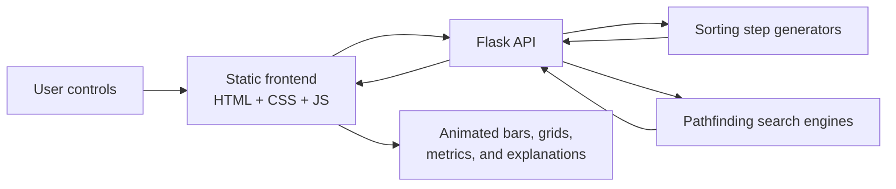

<div align="center">

# The Algorithm Laboratory and Comparative Simulation Suite

**An interactive full-stack playground for watching algorithms think.**

Compare sorting algorithms side by side, explore shortest-path search on an editable grid, and learn the vocabulary behind the visuals through a searchable glossary.


<br>

[`Sorting Duel`](#sorting-duel) |
[`Pathfinding Lab`](#pathfinding-lab) |
[`Glossary`](#glossary-and-definitions) |
[`API`](#api-reference) |
[`Setup`](#quick-start)

</div>

---

## What Is This?

The Algorithm Laboratory is an educational visualization suite built for students, teachers, and curious developers who want to see classic algorithms move instead of only reading pseudocode.

The project uses a **Python Flask backend** to generate authoritative algorithm execution data and a **lightweight HTML/CSS/JavaScript frontend** to render those steps as animations. There is no frontend build system, no heavyweight framework, and no mystery layer between the algorithm and what appears on screen.



## Why It Stands Out

| Experience | What It Does | Why It Matters |
| --- | --- | --- |
| **Sorting Duel** | Runs two sorting algorithms on the same input array | Makes performance differences visible, not abstract |
| **Pathfinding Lab** | Animates graph search over an editable grid | Shows how search strategies expand, hesitate, and commit |
| **Glossary and Definitions** | Explains core algorithm terms in searchable cards | Connects visuals to the language used in DSA classes |
| **Backend-generated steps** | Produces execution traces in Python | Keeps animation logic consistent and testable |
| **No Node required** | Frontend runs as static files | Simple setup for classrooms, demos, and college projects |

## Feature Snapshot

- Side-by-side sorting races on identical randomized data
- Start, pause, reset, speed, and element-count controls
- Comparison counters and backend logic-time measurements
- Interactive pathfinding grid with movable start and target nodes
- Wall drawing, path clearing, full grid reset, and maze presets
- Dijkstra, A*, and Bellman-Ford/SPFA-style pathfinding modes
- Dynamic algorithm information cards with complexity notes
- Searchable glossary for algorithm vocabulary
- Flask JSON API with validation
- Focused backend test coverage using `pytest`

## Sorting Duel

The sorting lab gives each algorithm its own arena while keeping the input identical. That means Bubble Sort, Quick Sort, Merge Sort, Heap Sort, Bogo Sort, and the rest are not just displayed; they are compared under the same conditions.

| Algorithm | ID | Family | Visualization Notes |
| --- | --- | --- | --- |
| Bubble Sort | `bubble` | Brute Force | Adjacent comparisons and swaps |
| Selection Sort | `selection` | Brute Force | Full scans with targeted minimum placement |
| Insertion Sort | `insertion` | Decrease and Conquer | Growing sorted prefix |
| Quick Sort | `quick` | Divide and Conquer | Pivot-based partition movement |
| Merge Sort | `merge` | Divide and Conquer | Recursive split and merge behavior |
| Heap Sort | `heap` | Selection Method | Heap construction and extraction |
| Bogo Sort | `bogo` | Randomized Brute Force | Chaotic shuffles with a safety cap |
| Optimized Bogo Sort | `optbogo` | Randomized Decrease | Shuffles only the unresolved region |
| Counting Sort | `counting` | Distribution Sort | Count-based placement, no pairwise sorting |
| Radix Sort | `radix` | Distribution Sort | Digit-by-digit stable passes |

The backend returns a sequence of `compare` and `swap` steps. The frontend uses those steps to animate bars, update counters, and display the final sorted state.

## Pathfinding Lab

The pathfinding page turns a grid into a searchable graph. Users can draw walls, drag the start and target nodes, generate maze patterns, and watch each algorithm decide where to search next.

| Algorithm | ID | Search Style | Current Grid Behavior |
| --- | --- | --- | --- |
| Dijkstra's Algorithm | `dijkstra` | Uniform-cost shortest path | Expands outward by cheapest known distance |
| A* Search | `astar` | Heuristic-guided shortest path | Uses Manhattan-style direction toward the target |
| Bellman-Ford/SPFA Variant | `bellmanford` | Queue-based relaxation | Revisits improved paths using a queue approach |

The current grid uses **uniform movement cost**. Weighted terrain is not implemented yet, which keeps the visualization focused on the search pattern rather than cost modeling.

## Glossary And Definitions

The glossary page is a searchable companion to the labs. It explains the terms students repeatedly meet while studying algorithms, including:

- Big O notation
- auxiliary space
- stable sort
- pivot
- partition
- time complexity
- relaxation
- heuristic
- priority queue

## Project Structure

```text
The Algorithm Laboratory and Comparative Simulation Suite/
|-- backend/
|   |-- algs.py              # Sorting step generators
|   |-- app.py               # Flask API routes and validation
|   `-- pathfinding.py       # Dijkstra, A*, and Bellman-Ford/SPFA logic
|-- frontend/
|   |-- index.html           # Sorting Duel page
|   |-- pathfinding.html     # Pathfinding visualizer page
|   |-- definitions.html     # Glossary page
|   |-- css/
|   |   |-- style.css
|   |   `-- definitions.css
|   `-- js/
|       |-- algorithmData.js
|       |-- api.js
|       |-- controls.js
|       |-- definitions.js
|       |-- pathfinding.js
|       |-- pathfindingData.js
|       |-- renderer.js
|       `-- utils.js
|-- tests/
|   `-- test_backend.py
|-- install_dependencies.bat
|-- README.md
`-- .gitignore
```

## Tech Stack

| Layer | Tools |
| --- | --- |
| Backend | Python, Flask, Flask-CORS |
| Algorithms | Pure Python step generators |
| Frontend | HTML, CSS, vanilla JavaScript |
| Testing | pytest |
| Setup | Windows batch installer plus manual virtual environment option |

## Quick Start

### 1. Install dependencies

The simplest Windows setup path is:

```bat
install_dependencies.bat
```

That script creates a virtual environment and installs:

- `flask`
- `flask-cors`
- `pytest`

Manual setup also works:

```powershell
python -m venv venv
venv\Scripts\Activate.ps1
python -m pip install --upgrade pip
pip install flask flask-cors pytest
```

If you are using Command Prompt:

```bat
venv\Scripts\activate.bat
```

### 2. Start the backend

From the project root:

```powershell
venv\Scripts\python backend\app.py
```

The API runs at:

```text
http://127.0.0.1:5000
```

### 3. Open the frontend

Open this file in a browser:

```text
frontend/index.html
```

From there, use the in-app navigation to move between:

- Sorting Duel
- Pathfinding
- Definitions

## API Reference

### `POST /sort`

Generates animation steps for a sorting algorithm.

Request:

```json
{
  "algorithm": "quick",
  "array": [42, 7, 19, 3, 25]
}
```

Response:

```json
{
  "steps": [
    {
      "type": "compare",
      "indices": [0, 4],
      "current_state": [42, 7, 19, 3, 25]
    }
  ],
  "execution_time": 0.123
}
```

Supported algorithm IDs:

```text
bubble, selection, insertion, quick, merge, heap, bogo, optbogo, counting, radix
```

### `POST /pathfind`

Generates visited nodes and shortest-path output for a grid search.

Request:

```json
{
  "algorithm": "astar",
  "rows": 10,
  "cols": 10,
  "startNode": { "row": 0, "col": 0 },
  "endNode": { "row": 9, "col": 9 },
  "walls": [
    { "row": 1, "col": 2 },
    { "row": 2, "col": 2 }
  ]
}
```

Response:

```json
{
  "visited_nodes": [
    { "row": 0, "col": 0 },
    { "row": 0, "col": 1 }
  ],
  "path": [
    { "row": 0, "col": 0 },
    { "row": 0, "col": 1 },
    { "row": 1, "col": 1 }
  ]
}
```

Supported pathfinding IDs:

```text
dijkstra, astar, bellmanford
```

## Testing

Run the backend tests with:

```powershell
venv\Scripts\python -m pytest
```

The current tests cover:

- sorting algorithms reaching the correct final sorted state
- `/sort` endpoint validation
- `/sort` success responses
- `/pathfind` validation behavior

## Educational Design

This project is built as a learning tool, not just a visual effect. The important design idea is that every animation should connect to a concept:

| Concept | How The Lab Shows It |
| --- | --- |
| Comparisons | Highlighted bar pairs during sorting |
| Swaps and writes | Animated state changes in the bar array |
| Runtime behavior | Side-by-side comparison and logic-time metrics |
| Search frontier | Visited grid nodes expanding over time |
| Shortest path | Reconstructed final route from start to target |
| Complexity language | Info cards and glossary definitions |

## Known Characteristics

- The sorting visualizer measures backend logic time separately from animation speed.
- Bogo-style algorithms are intentionally capped to prevent browser lockups.
- Counting Sort and Radix Sort only support non-negative integers in the backend.
- The pathfinding grid currently uses uniform-cost movement.
- The frontend is optimized for local use and project demos rather than production deployment.

## Roadmap Ideas

- Weighted terrain for pathfinding
- More graph algorithms such as BFS, DFS, Greedy Best-First Search, and Floyd-Warshall
- More maze generators and obstacle presets
- Exportable experiment summaries
- More frontend interaction tests
- Mobile layout polish for smaller screens
- A hosted demo build

## Author Notes

This repository is a strong fit for:

- DSA coursework
- algorithm visualization demos
- classroom explanations
- project presentations
- interview-prep experiments
- comparing textbook complexity with visual behavior

## License

No license file is currently included. Add a license before publishing or distributing the project publicly.

---

<div align="center">

**Built to make algorithms feel less like static notes and more like systems you can inspect, compare, and understand.**

</div>
